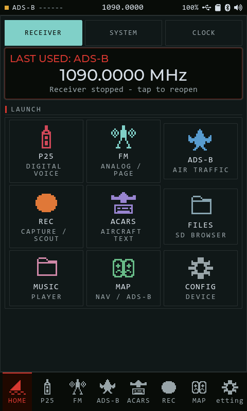
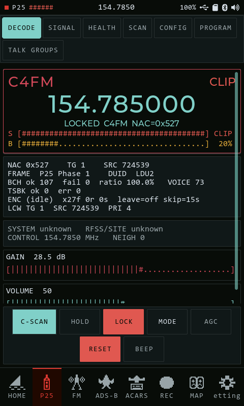

A handheld SDR scanner running on the ESP32-P4 with an [RTL-SDR Blog V3 or V4](https://www.ebay.com/str/rtlsdrblog?_trksid=p4429486.m3561.l161211) plugged into its USB host port.

It's currently in a very early devlopment stage and will be broken up into a few different releases. Right now I will release a headless firmware and a GUI version. The GUI started on [esp-brookesia](https://github.com/espressif/esp-brookesia) but I've since swapped it for my own handheld-radio LCD shell. I will try my best to get these to be cross compatible with different boards and configurations, so please submit an issue if you have trouble.

Designed to work with my other project [CartoTUI - a terminal ascii map.](https://github.com/SAMS0N1TE/CartoTUI)

| | |
| --- | --- |
|  |  |


## °<)))>< Standing on

None of the hard parts are mine. A P25 receiver on a microcontroller only
exists because people spent years getting these right and then gave them away.

**Receiving and decoding**

| | |
|---|---|
| [rtl-sdr / librtlsdr](https://osmocom.org/projects/rtl-sdr) | Osmocom. The dongle driver everything starts from. GPL-2.0+ |
| [xtrsdr](https://github.com/XTR1984/xtrsdr) | XTR1984. Cut librtlsdr down until it fit an ESP32. Without this there is no project |
| [OP25](https://github.com/boatbod/op25) | Pavel Yazev's fixed-point `imbe_vocoder`. P25 voice on a chip with no FPU. GPL-3.0+ |
| [DSD / dsd-fme](https://github.com/lwvmobile/dsd-fme) | lwvmobile. P25 framing and the DSD lineage the decoders follow. GPL |
| [mbelib](https://github.com/szechyjs/mbelib) | szechyjs. Kept as a fallback vocoder. ISC |

**Everything it runs on**

| | |
|---|---|
| [ESP-IDF](https://github.com/espressif/esp-idf) | Espressif. The whole platform |
| [LVGL](https://lvgl.io/) | The graphics toolkit the panel UI is built in |
| [esp-brookesia](https://github.com/espressif/esp-brookesia) | Espressif. The GUI started here before it moved to its own shell |
| [Waveshare ESP32-P4 BSP](https://www.waveshare.com/) | Board support for the carriers |
| [LoRaMesher](https://github.com/LoRaMesher/LoRaMesher) | The mesh side, still WIP |

**Maps, fonts and the rest**

| | |
|---|---|
| [PMTiles](https://github.com/protomaps/PMTiles) | Protomaps. One file, no server, seekable. What makes offline maps possible here |
| [VersaTiles](https://versatiles.org/) | Free OSM vector tiles, and fine with you fetching a region |
| [OpenStreetMap](https://www.openstreetmap.org/copyright) | The map data itself, ODbL |
| [DejaVu Sans Mono](https://dejavu-fonts.github.io/) | The readout face. Bitstream Vera licence |
| [Flipper Zero](https://flipperzero.one/) | The head runs as a Flipper app |

The IMBE and AMBE codecs are covered by DVSI patents. That is a separate
matter from the licences above and it does not go away because the code is
open. Educational and experimental use, and your local rules are yours.

## <°)))><

- **P25** | Project 25 Phase 1 (C4FM) trunked/conventional digital voice.
  On-device IMBE voice decode using OP25's fixed-point vocoder; live NAC / TG /
  SRC, BCH health, and display.
- **FM Monitor** | wideband broadcast FM, narrowband FM voice (LISTEN), band
  SCAN, and POCSAG pager decode | sharing one integer `rtl_fm`-style front end.
- **ADS-B** | 1090 MHz aircraft tracking, with a moving map on the Flipper head.
- **Sub-GHz capture** | threshold-triggered pulse capture around 433 MHz, saved
  to SD as `.sub` you can open in the Flipper's SubGHz app.
- **ACARS** | receiver, decoder and message display. Not confirmed on air yet.
- **DMR** | decoder is in the tree (sync, BPTC, LC framing) but there's no DMR
  mode to select yet, and no AMBE. WIP.
- **LoRa Mesh** | on-board SX1262 + LoRaMesher gateway with a live node/link view, VERY WIP.

## ><> Downloads

| Board | Flash | Build | Firmware | Flipper App |
|-------|-------|-------|----------|-------------|
| [ESP32-P4-NANO](https://www.waveshare.com/esp32-p4-nano.htm) | 16MB | Headless (P25 / ADS-B / FM / POCSAG / REC), serial console + Flipper | [v1.0.3](https://github.com/SAMS0N1TE/LakeShark/releases/tag/v1.0.3) | [v2.4](https://github.com/SAMS0N1TE/LakeShark-Flipper/releases/tag/v2.4) |
| [ESP32-P4-WIFI6](https://www.waveshare.com/product/arduino/boards-kits/esp32-p4/esp32-p4-wifi6.htm) | 32MB | Headless, same as above | [v1.0.3](https://github.com/SAMS0N1TE/LakeShark/releases/tag/v1.0.3) | [v2.4](https://github.com/SAMS0N1TE/LakeShark-Flipper/releases/tag/v2.4) |
| [ESP32-P4-WIFI6-Touch-LCD-4.3](https://www.waveshare.com/esp32-p4-wifi6-touch-lcd-4.3.htm) | 32MB | GUI on the 480x800 panel. Read the power note below before you buy one | [v1.0.3](https://github.com/SAMS0N1TE/LakeShark/releases/tag/v1.0.3) | [v2.4](https://github.com/SAMS0N1TE/LakeShark-Flipper/releases/tag/v2.4) |
| [ESP32-P4-WIFI6-Touch-LCD-4B](https://www.waveshare.com/product/arduino/boards-kits/esp32-p4/esp32-p4-wifi6-touch-lcd-4b.htm) (Smart 86 Box) | 32MB | GUI, 720x720. Builds from source, not in the current release | [v0.2.0](https://github.com/SAMS0N1TE/LakeShark/releases/tag/v0.2.0) | n/a |
| [LilyGo T-Display P4](https://lilygo.cc/products/t-display-p4) | 16MB | Coming Soon &mdash; see below | n/a | n/a |

Each firmware download is a zip per board. Unzip it and run `flash.bat` on
Windows or `./flash.sh` on Mac/Linux — it grabs esptool if you don't have it and
finds the board itself. The offsets differ between the 16MB and 32MB boards so
don't mix archives.

Notes: Waveshare LCD 4.3 is a very misleading build. The schematics seem to point towards the ultimate configuration, however I must not be great at understanding them. The way power is routed is awful. If you power the board via the provided battery port, 5V is routed away from everything. This includes ALL GPIO, and the USB 2.0 HS port/UART. This seems to be the case for many of the LCD lines from Waveshare (86 Box was the same), but with that board you are able to remove/bridge a MOSFET to route the 5V out permanently through USB 2.0 HS. This then lets you power the 86 Box via GPIO with a boost convertor. (assets folder holds detailed screenshots of this method).

This is not the case with the LCD 4.3 variant. Removing the same MOSFET does let you provide 5V out through USB HS 2.0, however, due to the insane design of the rest of the power path, powering via GPIO does NOT route 5V there. I have no idea why it's this complicated and unfortunately didn't check if 5V worked prior to the MOSFET removal/GPIO powering, but I am betting it wont. This basically leaves you with powering via the UART USB-C port and a power bank, which sucks. I have the furthest build with this board, full support with remote subghz recording and storage. Plus tons of new features. I will release it, but will no longer support it going forward as I will be moving on to the Lilygo T-Display P4. - 8/28/2026

All builds are on the [releases page](https://github.com/SAMS0N1TE/LakeShark/releases).

## ><)))°> The Flipper head

The [Flipper app](https://github.com/SAMS0N1TE/LakeShark-Flipper) drives the
radio over Bluetooth or the GPIO header, so the receiver can sit in a bag with
the antenna and you keep the Flipper in your hand.

| | |
| --- | --- |
|  |  |
|  |  |
|  |  |

**Don't power the ESP32-P4 from the Flipper's 5V pin.**

## ><)))°> Coming soon


The [LilyGo T-Display P4](https://lilygo.cc/products/t-display-p4). A screen, a
real keyboard and a battery in one shell — no soldering, no boost converter, no
fighting the power path. This is where LakeShark is going next.

## }<((((()°> Hardware notes

You need one of the boards listed above and the accompanying firmware. Other ESP32-P4 boards probably work but I haven't tried them and will continue to add to the roster. RTL-SDR V3/V4 are the target dongles; older V3 sticks work but you'd lose the triplexer routing (Not crazy important in my tests). In my opinion, I wouldn't try sourcing the V4's as they're a dead end in terms of support. 

Pin mapping for the audio: I²S MCLK=13 BCK=12 WS=10 DOUT=9 DIN=11, codec PA enable on GPIO 53, I²C SDA=7 SCL=8, USB VBUS enable on 46 for nano board. Smart 86 Box requires soldering. Will type out a tutorial soon. Not a hard thing to do at all though. 

- Optional SX1262 LoRa module for the mesh app WIP.

## ><)))O> Build & flash

Requires **ESP-IDF v5.5.4** and its managed Python environment. Each board needs
its own build directory and sdkconfig:

```bash
idf.py -B build_nano  -D SDKCONFIG=build_nano/sdkconfig  -D SDKCONFIG_DEFAULTS="sdkconfig.defaults;boards/nano_headless_ble.defaults" build
idf.py -B build_wifi6 -D SDKCONFIG=build_wifi6/sdkconfig -D SDKCONFIG_DEFAULTS="sdkconfig.defaults;boards/wifi6_headless_ble.defaults" build
idf.py -B build_lcd43 -D SDKCONFIG=build_lcd43/sdkconfig -D SDKCONFIG_DEFAULTS="sdkconfig.defaults;boards/lcd43_gui.defaults" build
```

Then flash the one you built:

```bash
idf.py -B build_nano -D SDKCONFIG=build_nano/sdkconfig -p /dev/ttyACM0 flash monitor
```

If you're coming from a release zip instead, just run the `flash.bat` /
`flash.sh` inside it.

> The `managed_components/` tree is committed because the Waveshare BSP is patched
> in-place. After switching host OS, run `idf.py fullclean` once (the `build/`
> cache stores absolute paths).

Setup guides: [first flash](docs/LCD43_FIRST_FLASH.md) for a board that has
never run this, [quickstart](docs/LCD43_QUICKSTART.md) for one that has, and
[troubleshooting](docs/LCD43_TROUBLESHOOTING.md) when it goes wrong.

## Architecture & specs

- **SoC/board** | ESP32-P4 (dual-core RISC-V). PSRAM at 200 MHz. Panels are
  720x720 MIPI-DSI on the 86 Box and 480x800 on the LCD-4.3; the NANO and
  WIFI6 run headless.
- **Sample rates** | RTL-SDR over USB host runs at 240 kSPS for P25, 256 kSPS for
  FM/POCSAG, and 2 MSPS for ADS-B. Audio out is 16 kHz mono.
- **Integer DSP** | the FM front end is a fixed-point `rtl_fm`-derived pipeline and
  P25 voice uses OP25's integer `imbe_vocoder`. Demod runs real-time with no IQ drops, and one P25 LDU decodes well under real-time.
- **USB streaming** | self-resubmitting USB transfers fill a PSRAM IQ ring. 
- **Audio** | 16 kHz output ring with a prebuffer sized above one decode burst.
- **LCD shell** | a custom LVGL UI.

## 3D Print Sneak Peaks


## Credits & licenses

This project is released under the **GNU GPL v3** (see `LICENSE`), as required by
its GPL dependencies. It bundles and builds on:

- [rtl-sdr / librtlsdr](https://osmocom.org/projects/rtl-sdr) | Osmocom (GPL-2.0+)
- [xtrsdr](https://github.com/XTR1984/xtrsdr) - For the amazing work with getting it lean enough for the ESP32.
- [OP25 `imbe_vocoder`](https://github.com/boatbod/op25) | Pavel Yazev (GPL-3.0+)
- [mbelib](https://github.com/szechyjs/mbelib) | ISC (kept as a fallback decoder)
- [DSD / dsd-fme](https://github.com/lwvmobile/dsd-fme) | P25 framing (GPL)
- [LoRaMesher](https://github.com/LoRaMesher/LoRaMesher) | mesh networking
- [esp-brookesia](https://github.com/espressif/esp-brookesia) | UI launcher
- LVGL, and the Espressif ESP-IDF and Waveshare ESP32-P4 BSP

Original copyright/license headers in third-party sources are preserved verbatim.
See [docs/THIRD_PARTY_REVIEW.md](docs/THIRD_PARTY_REVIEW.md) for the full
inventory.

> **Legal note:** the IMBE/AMBE voice codecs are covered by patents held by DVSI.
> This firmware is provided for educational and experimental use; you are
> responsible for compliance with applicable laws and licenses in your region.
