# FILES, replay and aircraft tracking — development preview

These controls are from the T-Display-P4 development build checked on September 23, 2026. They are **not a newly cleared firmware release**. The current published release is [2.2.1](https://github.com/SAMS0N1TE/LakeShark/releases/tag/v2.2.1); use the firmware and instructions for your exact board.

The pictures below are native device framebuffer captures, not simulator renders. The replay example is a synthetic test file at 433.920 MHz, with 300 edges and a stored duration of 268.80 ms. Aircraft screenshots use **example home coordinates, 43.00000, -71.00000**, not the receiver's position. Empty traffic means no aircraft were available in that capture.

## Open a recording from FILES

1. Open **FILES**, browse the SD card and select a supported `.sub` file.
2. Open its preview, then **ACTIONS → REPLAY**. RECORD opens with the file loaded. Loading does not transmit.
3. Check the destination radio, format, frequency, duration and nominal power.
4. Use **POWER− / POWER+**, then **PLAY ONCE**. On the keyboard, **P** plays once and **+/−** changes power.

RAW OOK files use CC1101. Compatible FSK recordings use the existing SX1262 path. A file's metadata determines replay support; a file extension or a source-menu entry alone does not make a recording replayable.

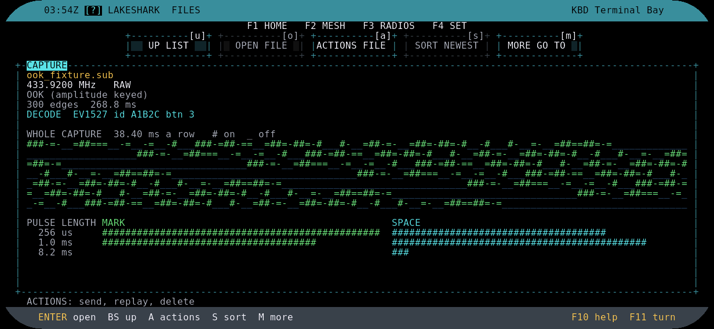

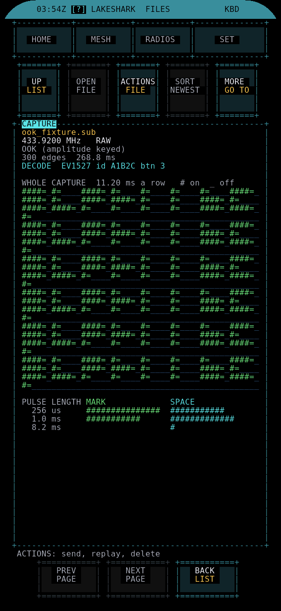

## Replay controls and the moving line

RECORD has **RECORD**, **REPLAY** and **FILES** tabs. The replay panel shows a bounded preview of the stored pulses; its axis states how much of the file is visible. Tap a pulse to read its exact HIGH/LOW duration. Yellow marks the selected pulse.

The white line and blue/cyan trail show worker activity. The sweep takes **350 ms**, four times faster than the earlier 1.4-second animation. It includes radio setup time and **does not show measured RF progress or exact playback position**. When the worker completes, the existing sweep exits without starting a second pass, then the waveform returns to plain green. Read the status line for completion or failure.

Replay is one bounded send. There is no implied repeat loop, sample-accurate transport timeline or calibrated RF-power measurement.

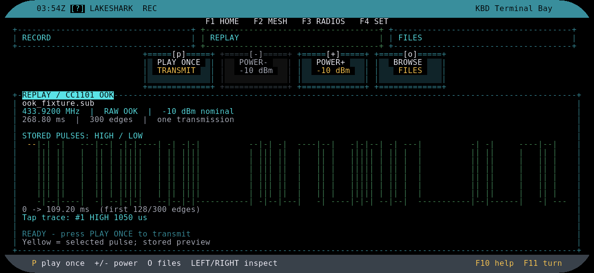

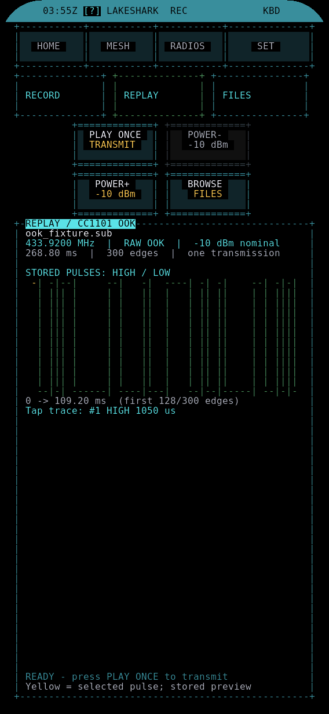

## Recording sources

The source picker exposes RTL-SDR, CC1101, GPS/GNSS, HackRF, SX1262/LoRa, nRF24, NFC, Wi-Fi and Bluetooth. Each source names its available data format. Metadata recording is distinct from raw waveform recording, and missing adapters remain explicit limitations.

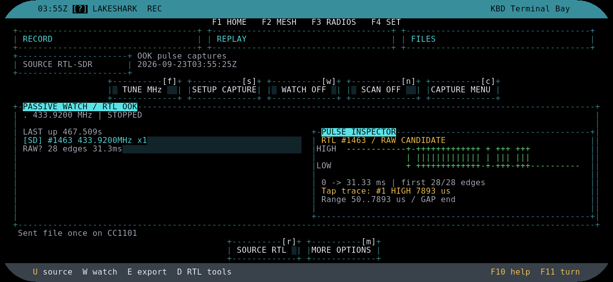

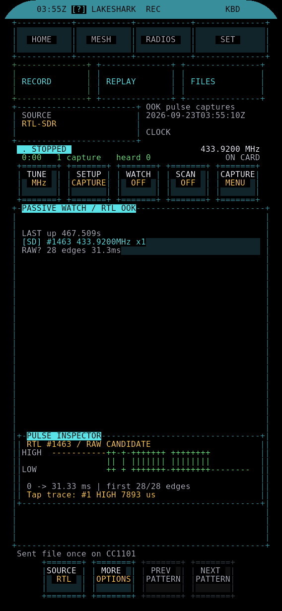 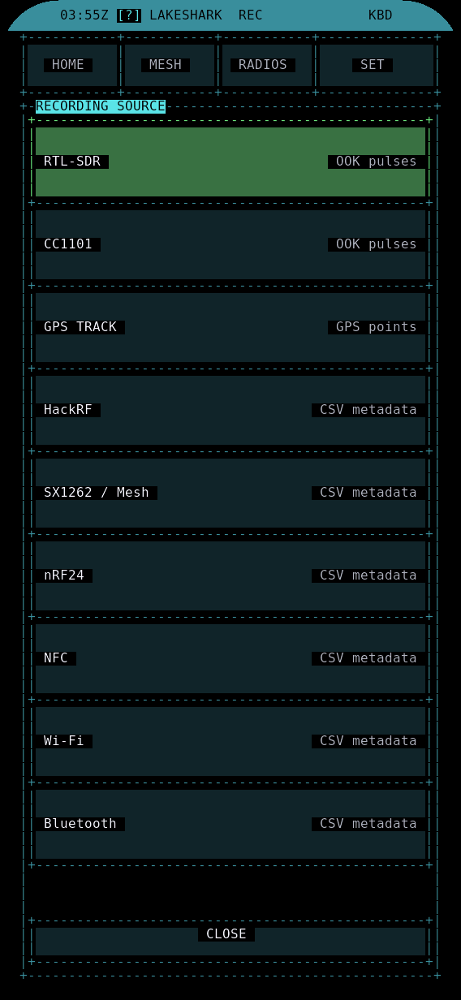

## ADS-B mini map and remembered home

The aircraft screen combines the traffic list with an offline mini map. **MAP ONLY** gives the map more space; **FULL MAP** opens the map application. **ZOOM+ / ZOOM−** adjusts the view.

Open **SET HOME** and choose a fresh GPS fix, decimal latitude/longitude, a place on the map, or the current map center. Saving home is explicit and persists for later sessions. GPS is not required when entering coordinates or using a map center. Offline terrain still requires a compatible map archive on the SD card.

Use the on-screen legend for home, aircraft, selected aircraft and stale positions. A saved home point is a reference location, not proof of a current receiver fix. Missing or stale positions must not be read as live tracking.

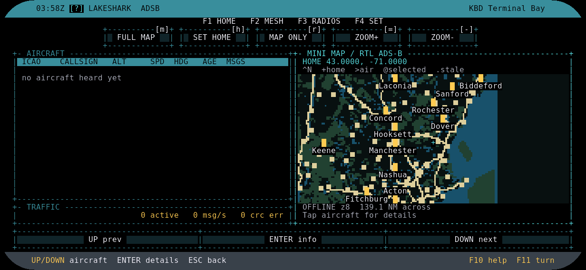

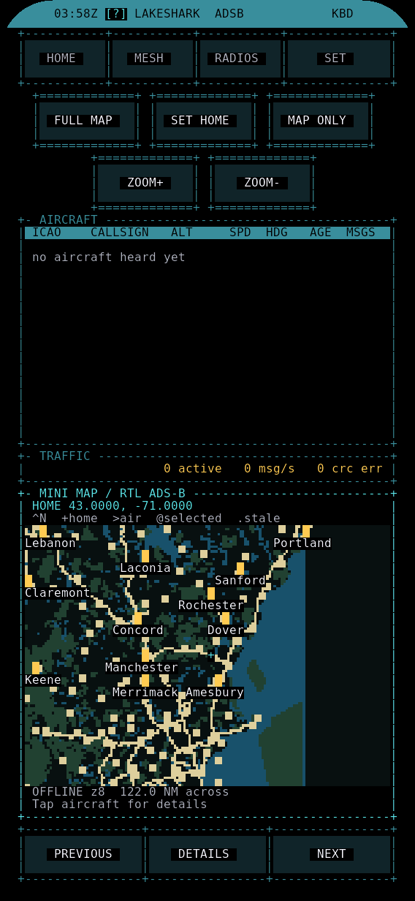 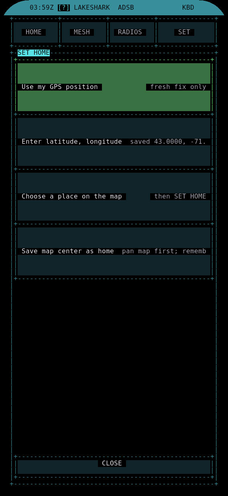

## SUB-GHZ

SUB-GHZ keeps its passive capture and pulse-inspection controls. The FILES-to-RECORD replay route complements that workflow.

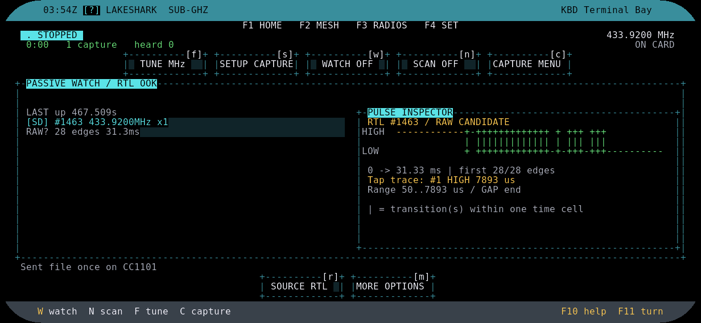

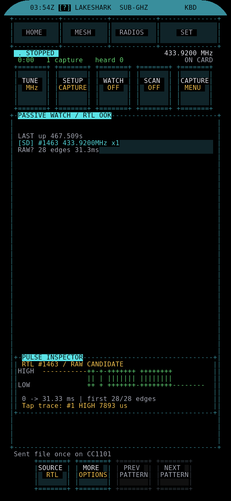

## What the checks establish

Host tests, firmware builds, serial-driven UI checks and real framebuffer captures establish specific software behavior. They do not establish independent RF timing, physical touch reliability, speaker quality or absence of visible panel flashing.

The release sweep retains blockers for Flipper lifecycle/control, independent RF acceptance, GPS recording and memory headroom, historical watchdog/restart cases, source-adapter coverage, and clean public-source/build reconciliation. Wi-Fi retries were observed with the saved network unavailable; successful reconnection was not established. No release was promoted on the strength of these screenshots.
