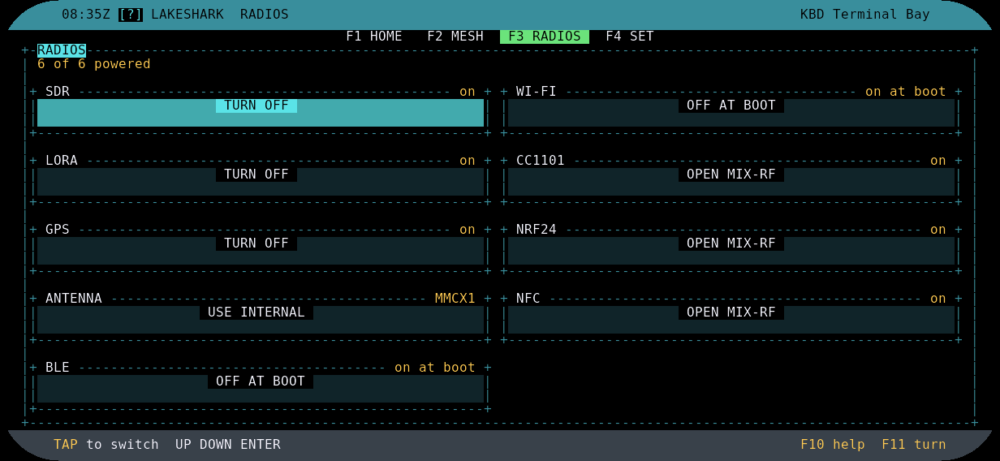
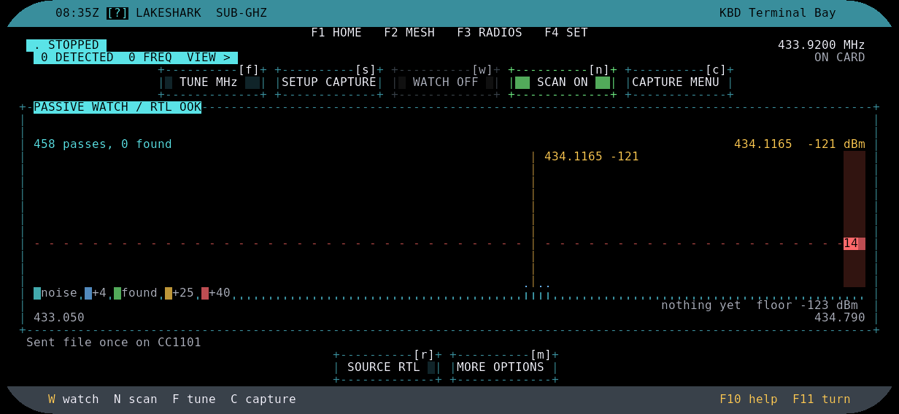
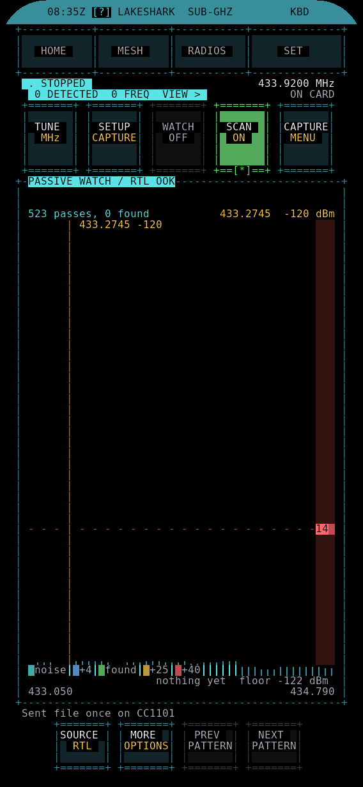

# Scanning, replay and aircraft tracking

Browse recordings, replay captures and follow aircraft on the T-Display-P4.

## Open a recording from FILES

1. Open **FILES**, browse the SD card and select a supported `.sub` file.
2. Open its preview, then **ACTIONS → REPLAY**. RECORD opens with the file loaded. Loading does not transmit.
3. Check the destination radio, format, frequency, duration and nominal power.
4. Use **POWER− / POWER+**, then **PLAY ONCE**. On the keyboard, **P** plays once and **+/−** changes power.

RAW OOK files use CC1101. Compatible FSK recordings use SX1262.

## Replay controls and the moving line

RECORD has **RECORD**, **REPLAY** and **FILES** tabs. Tap a pulse in the replay preview to see its HIGH/LOW duration. Yellow marks the selected pulse.

A white line with a blue/cyan trail shows playback activity. Read the status line for completion or errors.

## Recording sources

Choose from RTL-SDR, CC1101, GPS/GNSS, HackRF, SX1262/LoRa, nRF24, NFC, Wi-Fi and Bluetooth. Select a source to see its available formats.

 

## ADS-B mini map and remembered home

The aircraft screen combines the traffic list with an offline mini map. **MAP ONLY** gives the map more space; **FULL MAP** opens the map application. **ZOOM+ / ZOOM−** adjusts the view.

Open **SET HOME** and choose a GPS fix, decimal latitude/longitude, a place on the map, or the current map center. Save your home location to reuse it in later sessions. GPS is optional when setting home manually. Offline terrain requires a compatible map archive on the SD card.

The on-screen legend identifies home, aircraft, selected aircraft and stale positions.

 

## Wi-Fi and Bluetooth

Open **RADIOS** and use **ON AT BOOT / OFF AT BOOT** for **WI-FI** and **BLE**. Restart to apply the saved choices. **LINK** manages Wi-Fi networks and shows the Flipper connection.

## SUB-GHZ

Use **SCAN / N** and choose a band or a range around the current frequency. The moving sweep line shows the frequency being sampled. Open **MORE OPTIONS → DISPLAY** to choose the spectrum style and colour palette.

Drag the threshold line to change detection sensitivity. Tap **DETECTED** to browse hits, then choose **CAPTURE IT**, **TUNE HERE** or **ZOOM IN**. While scanning, **SCAN → ON DETECT** selects NOTHING, BUZZ or BUZZ + CATCH. **SCAN → STOP** ends the sweep.

