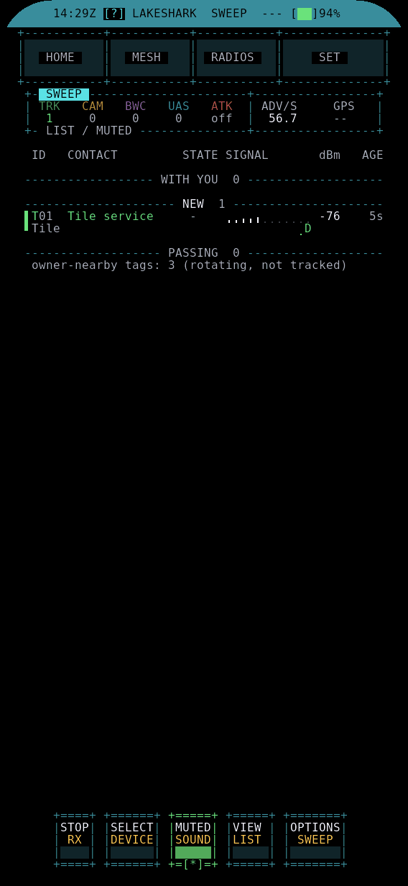

# SWEEP

SWEEP is a passive scanner for nearby Bluetooth and Wi-Fi broadcasts. It lists
trackers (Apple Find My, Google, Samsung, Tile), Remote ID drones and camera or
bodycam hints, and helps you walk toward one. It only listens; it never
transmits.

Open **HOME > FIELD > SWEEP**. It sits beside COMPASS.

## Start

1. Press **START** (or **S**) to begin receiving. **STOP** ends it. SWEEP
   remembers whether it was running after a restart.
2. Alert sounds start muted. **MUTE** (or **M**) switches them on and off. Mute
   and your speaker volume are respected.

The header counts each category: **TRK** trackers, **CAM** cameras, **BWC**
bodycams, **UAS** drones and **ATK** attack tools, with adverts per second and
the GPS state.

## LIST

Contacts are grouped:

- **WITH YOU**: a tracker reported as separated from its owner that stays
  with you for ten minutes. With a GPS fix it must also follow you at least
  500 m or across three places. A GPS-backed WITH YOU is the one red alarm on the screen.
- **NEW**: first heard in the last two minutes.
- **PASSING**: everything else.

Each row shows the category, label, owner state, a signal strip for the last
minute, dBm and age. Trackers near their owner rotate their address; SWEEP
counts them on one line instead of listing each address.

Up/Down or **[ ]** select a contact. Enter or **SELECT** picks it.

## HUNT

**VIEW** (or **V**) switches between LIST and HUNT for the selected contact.
HUNT shows a large dBm readout on a cold-to-hot gauge, **CLOSER**, **FARTHER**
or **STEADY** over the last 10 seconds, the peak held for 15 seconds, and the
last 60 seconds as a strip with high, low and gaps. **B** or a tap on the
AVERAGE row switches FAST (2 s) and SLOW (8 s) averaging.

**FIND** (or **F**) hands the selected address to COMPASS FIND, so you can turn
for a bearing.

For a drone, HUNT also shows range and bearing to the aircraft and operator
positions it reports, when you have a GPS fix.

## OPTIONS

- **CATEGORIES / MUTE**: each of CAMERA, BODYCAM, DRONE and TRACKER can be OFF,
  SOUND or MUTED. ATTACK is opt in.
- **PRIVACY / LOGGING**: LOG ALERTS TO SD is off by default. When on, it writes
  uptime, address, category and signal to `/sdcard/sweep/alerts.csv`, with no
  location and no broadcast payload.
- **DISPLAY / FILTER**: show ALL or one category.
- **RELOAD SD RULES**: reads `/sdcard/sweep/rules.json` again. The board writes
  the default rules there the first time. A rule matches on vendor prefix,
  company ID, service UUID, name or SSID.

## Console

`sweep on|off|status|stats|list|hunt MAC|mute on|off|mute CAT|rules reload`
from TERMINAL or USB.

## Good to know

- Names and signatures are hints, not proof of what a device is.
- Signal strength guides you closer; it is not a distance or a bearing.
- GPS is used for movement counts only. SWEEP keeps no coordinates.
- SWEEP shares the Wi-Fi scan results the board already has, so LINK keeps
  scanning and joining networks while it runs.
- The [Flipper companion](https://github.com/SAMS0N1TE/LakeShark-Flipper)
  (app 2.10) shows the category counts and top contacts, and can mute SWEEP.
