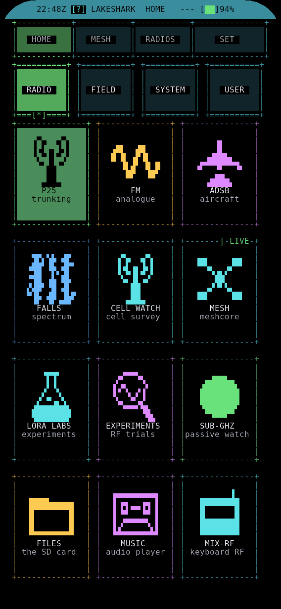

# T-Display-P4 screens

LakeShark 2.10.2 on the LilyGO T-Display-P4.

HOME groups apps under RADIO, FIELD, SYSTEM and USER. Use F1-F4 to choose a
group, arrows and Enter to open an app, and F5/F6 or PREV/NEXT to change pages.
The number of tiles per page depends on the screen size.

- RADIO: P25, FM, ADSB, FALLS, CELL WATCH, MESH, LORA LABS, EXPERIMENTS,
  SUB-GHZ, FILES, MUSIC, MIX-RF and DRONES.
- FIELD: NOTES, COMPASS, SWEEP, REC, MAP, TILES and GPS.
- SYSTEM: DIAG, TERMINAL, UPDATE, SET, RADIOS and LINK.
- USER: apps loaded from the SD card.

P25 has a DECODE / SIGNAL window. SPECTRUM toggles the plot; SCAN, SETTINGS,
CALLS and DMR open their views. CALLS is also available in FM.
See [UI controls](UI_CONTROLS.md) and [Updates and calls](TDP4_UPDATES_AND_CALLS.md).

FM > MORE > MODE includes APRS, AIS and SAME/EAS. Their detail pages are STATIONS,
VESSELS and ALERTS. NFM > OPTIONS > TONE provides CTCSS and DCS tone squelch.

MAP draws offline maps with CartoCore in smooth and braille styles alongside
FIELD. TILES downloads map regions and whole-state cell maps over WiFi, with
place search. See [MAP and TILES](MAP_TILES.md) and [Field map](map-field.md).

SWEEP lists nearby trackers, Remote ID drones and camera or bodycam hints, and
guides you toward one. It starts muted. See [SWEEP](SWEEP.md).
DRONES shows Remote ID drones with operator details. See [DRONES](DRONES.md).

LINK joins WiFi (up to eight saved networks), shows the Flipper Bluetooth link,
records a SURVEY walk and opens DRONES. UPDATE installs new builds over WiFi.

MUSIC plays WAV files, shows levels and spectra, and records microphone input.
TERMINAL runs console commands with the keyboard or touch keys. CELL WATCH
surveys cellular signals; it does not read subscriber messages.

EXPERIMENTS includes RS41 SONDES, LR433 and PAGER RECON. NOTE or N saves the
readout to NOTES. [Field and lab guide](FIELD_LABS.md) covers these receivers.
MESH node details offer INSPECT for route tracing, login, status and telemetry.
MAP > ROUTE follows a GPX file or backtracks a recorded walk.

## Scanning, replay and aircraft

FILES opens captures in REC for replay. SUB-GHZ watches raw signals. ADSB has a
mini map with FOLLOW choices for all aircraft, the selected one or the nearest.
The choice is kept. P25 and FM scan saved channel lists or stepped bands.
See [Location scanning](LOCATION_SCAN.md) and
[Scanning, replay and aircraft](REPLAY_AND_AIRCRAFT.md).

## Portrait

The app pages stack panels and use several rows of touch controls. HOME pages
its tiles. P25 keeps its DECODE / SIGNAL readout together, with SPECTRUM, SCAN,
SETTINGS, CALLS and DMR tiles below. NOTES opens touch keys for editing when no
keyboard is attached.

## Landscape

Pages use the wider view for plots, lists and side-by-side panels where space
allows. Controls adapt to whether a keyboard is attached. The displayed key
hints show the current bindings. F10 opens help; F11 rotates the screen.

## Daylight

SET > DISPLAY > Daylight uses black text on a white background. The underlying
theme choice is kept. MAP follows the theme, Daylight included. SET > Rotate
lock holds the current orientation.

## TFT version

LakeShark also builds for the T-Display-P4 TFT version (HI8561, 540 x 1168):
add `boards/t_display_p4_tft.defaults`. The screen is laid out around the front
camera. See [First flash](TDP4_FIRST_FLASH.md).
