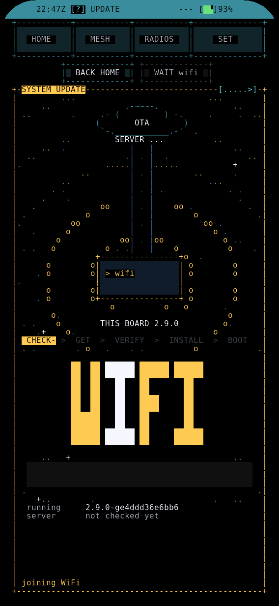

# Updates and calls

LakeShark 2.10.2 on the LilyGO T-Display-P4.

## UPDATE

A board on 2.9.0 or later updates over WiFi, or by USB with the web flasher at
any time. From 2.8 or earlier, install the current release once with the web
flasher or USB: 2.9.0 added the two app slots that updates over WiFi need. A
full install rewrites internal storage; settings and saved WiFi are kept. Back
up files first. See [First flash](TDP4_FIRST_FLASH.md).

1. Open LINK and connect to a saved or new WiFi network.
2. Open HOME > SYSTEM > UPDATE. The page checks for a newer build.
3. Choose INSTALL when offered. CHECK asks again; RETRY repeats a failed step.
4. Keep power connected while the download, checks and install finish. The board
   restarts into the new build.

Builds come from ota.terminalbay.com. The board checks the signed update offer
and the downloaded image. An invalid download is not selected for boot. If a
new build fails to start, the board returns to the previous build.

SET > DEVICE > Update opens the same page. Check for updates selects Daily or
Off. Daily is the default. A newer build adds a NEW tag to SYSTEM and UPDATE.
Off disables background checks; UPDATE > CHECK still works. An update over
WiFi replaces the app and keeps internal storage, settings and SD files.

## CALLS

Open CALLS in P25 or FM, or press 5. OPTIONS > CALLS > Recent calls opens the
same archive. CALLS is a media table: the list of recordings, newest first,
with a player, a progress bar and a waterfall of the call while it plays.

- Enter, a tap on a row, P or Space plays and pauses. N and , move to the next
  or previous call. **[** and **]** seek; a tap on the bar seeks too.
- STOP returns to receive. DELETE asks before removing a recording.
- KEEP marks a call so age cleanup leaves it; UNKEEP releases it.
- FILES opens the recording in FILES. T changes the sort.

An SD card is required. Clear P25 calls and FM audio that passes squelch can be
recorded while listening. Encrypted P25 audio is not archived. Playback pauses
radio reception until STOP. It uses the current volume and mute setting.

The header shows the call count, archive size and free card space. Recording
pauses (SPACE GUARD) when free space drops below 1 GB or 5% of the card,
whichever is larger, and resumes when space is back.

CALLS > OPTIONS offers:

- Record P25 and Record FM: both on by default.
- Minimum call (ms): 500 by default, adjustable from 0 to 10000.
- Keep newest days: 30 by default. Set 1 to 365 UTC days, or 0 to keep all.
- Only listed talkgroups: off by default. Talkgroup list accepts up to 32 P25
  talkgroup numbers separated by commas.
- Local UTC offset: shows times in your time zone.

Files go under `/sdcard/lakeshark/calls`, grouped by day, with WAV audio and
metadata beside it. P25 uses 8 kHz, 16-bit mono WAV, about 1 MB per minute.
FM uses 16 kHz, 16-bit mono WAV, about 2 MB per minute. Copy the files from the
card to keep them, or mark them KEEP.

DMR in P25 shows digital call activity, slots, colour codes and receive filters.
Voice playback and DMR recording are unavailable. Encrypted activity is marked
ENCRYPTED / MUTED.
